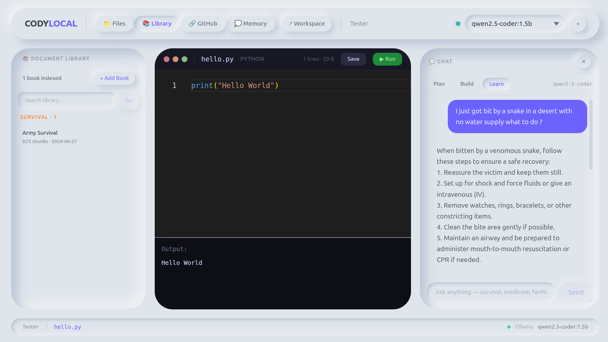
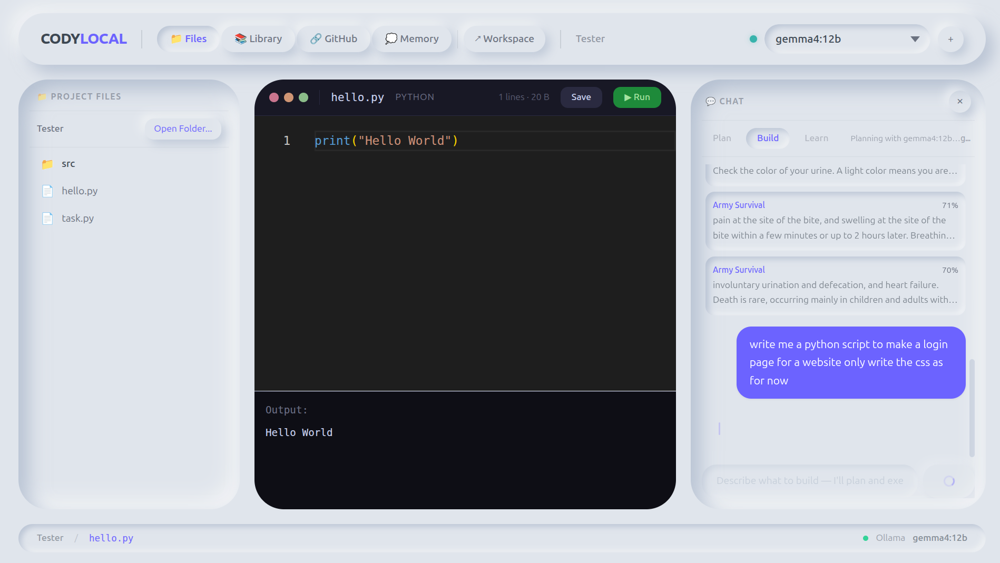

# Cody-Local on LinkedIn

## Post Caption

Built an offline AI coding assistant that works everywhere. No internet needed, runs on your laptop or external drive.

The use case hit me when my hometown lost internet for 35 days. My cousin was learning to code using AI, and suddenly had nothing. So I built something that runs locally using open-source models - no cloud, no APIs, no dependency on internet connectivity.

What makes it different: it's not just a chatbot. It's an autonomous agent. Write files, run tests, commit to git, all offline. You can index your own books and documents for semantic search. Ask it survival questions with the Army Manual loaded, medical questions with medical texts - whatever you feed it.

The tech stack is pragmatic. Qwen for coding, Gemma for reasoning, all running through Ollama locally. The whole thing fits on a USB stick. I built guardrails specifically for small models because not everyone has access to massive compute.

Open source. Portable. No credit cards needed.

---

## Screenshots

*Indexing survival guides and asking real questions offline*

*Write code, run it immediately, see output*

---

## Links

GitHub: https://github.com/Stradok/Cody-Local

Made for people like my cousin. Made for places like my hometown.
